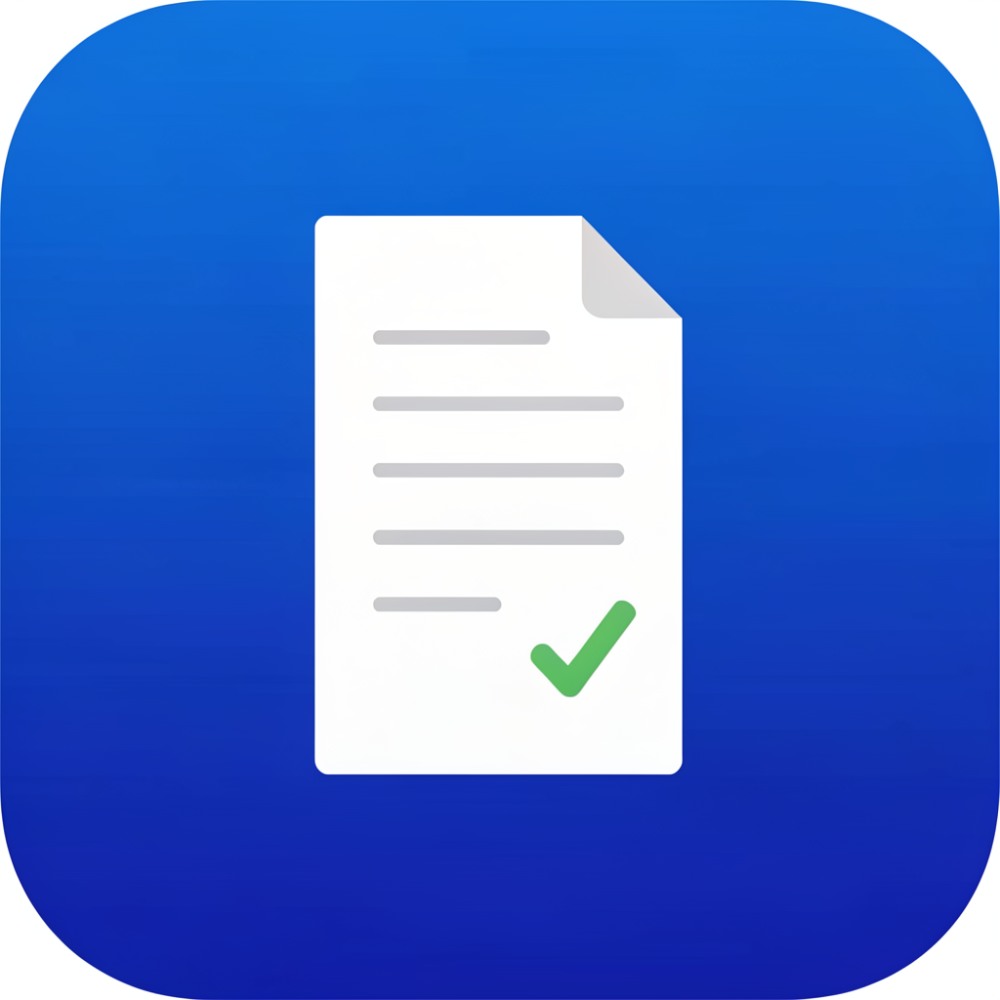

<p align="center">
  
</p>

<h1 align="center">ReceiptSnap 🧾</h1>
<p align="center"><strong>AI Receipt Scanner for US Freelancers</strong></p>

<p align="center">
  <a href="https://github.com/bambi2008/receiptsnap/actions"></a>
  <a href="#"></a>
  <a href="#"></a>
  <a href="#"></a>
  <a href="#"></a>
</p>

<p align="center">
  <b>Snap → Review → Export.</b> A short path from receipt photo to organized expense record.<br>
  On-device OCR. Expense-category suggestions. Accountant-friendly exports.
</p>

---

## ✨ What is ReceiptSnap?

ReceiptSnap is an iOS app that helps turn business receipt photos into organized expense records. It is built for **US freelancers, 1099 contractors, and self-employed professionals.**

Open the app → snap a photo → on-device OCR reads vendor, amount, and date → review the suggested category → export for your records or accountant.

```
📸 Snap     →     🤖 AI Reads     →     📊 Dashboard     →     📤 CPA Export
```

---

## 📱 Screenshots

<p align="center">
  <em>App Store screenshots (5/5 ready)</em>
</p>

| Camera | Result | Dashboard | Export | Paywall |
|:---:|:---:|:---:|:---:|:---:|
| Snap in 1 tap | OCR extracts data | Organize expenses | PDF to CPA | Localized App Store pricing |

> Screenshots at `assets/screenshots/` — optimized for iPhone 6.7" (1290×2796)

---

## 🏗 Architecture

```
┌──────────────────────────────────────────┐
│              Flutter UI Layer             │
│  ┌──────────┐ ┌──────────┐ ┌──────────┐ │
│  │  Camera  │ │Receipts  │ │ Settings │ │
│  │  Screen  │ │  Screen  │ │  Screen  │ │
│  └────┬─────┘ └────┬─────┘ └────┬─────┘ │
│       │            │            │        │
│  ┌────┴────────────┴────────────┴─────┐ │
│  │         Provider (State Mgmt)       │ │
│  │  ReceiptProvider │ SubscriptionProv │ │
│  └────┬─────────────┴──────┬──────────┘ │
├───────┼────────────────────┼────────────┤
│  ┌────┴──────────┐  ┌──────┴──────────┐│
│  │  OcrService   │  │ ExportService   ││
│  │  (Dart Bridge) │  │  (PDF/CSV)      ││
│  └────┬──────────┘  └─────────────────┘│
├───────┼─────────────────────────────────┤
│           Method Channel                 │
├───────┼─────────────────────────────────┤
│  ┌────┴──────────┐  ┌──────────────────┐│
│  │VisionOcrPlugin│  │ StoreKitManager  ││
│  │  (Swift)      │  │   (Swift)        ││
│  └────┬──────────┘  └──────────────────┘│
│       │                                 │
│  ┌────┴──────────┐                      │
│  │ Apple Vision  │                      │
│  │ (On-Device AI)│                      │
│  └───────────────┘                      │
│           iOS Native Layer               │
└──────────────────────────────────────────┘
```

**Key design decisions:**
- 🧠 **On-device OCR** — Apple Vision text recognition. Receipt images are not uploaded by ReceiptSnap for OCR.
- 💰 **StoreKit 2** — Native subscription management via Method Channel
- 📦 **Provider** — Lightweight state management (no Bloc/Redux overhead)
- 🔒 **Hive** — Fast local DB for receipts. All data stays on your phone.

---

## 📂 Project Structure

```
receiptsnap/
├── app/                           # Flutter application
│   ├── lib/
│   │   ├── config/                # categories, constants, theme
│   │   ├── models/                # Receipt data model
│   │   ├── providers/             # State management
│   │   │   ├── receipt_provider.dart
│   │   │   └── subscription_provider.dart
│   │   ├── screens/               # 5 screens
│   │   │   ├── camera_screen.dart      # Main capture UI
│   │   │   ├── receipts_screen.dart    # Dashboard + search
│   │   │   ├── detail_screen.dart      # Single receipt view
│   │   │   ├── onboarding_screen.dart  # First-launch flow
│   │   │   └── settings_screen.dart    # Preferences
│   │   ├── services/              # Business logic
│   │   │   ├── ocr_service.dart        # Dart ↔ Swift bridge
│   │   │   └── export_service.dart     # PDF/CSV generation
│   │   ├── widgets/               # Reusable components
│   │   │   ├── result_sheet.dart       # Post-scan card
│   │   │   └── paywall_sheet.dart      # Subscription upsell
│   │   ├── app.dart
│   │   └── main.dart
│   ├── ios/Runner/                # Native Swift plugins
│   │   ├── VisionOcrPlugin.swift       # Apple Vision OCR
│   │   ├── StoreKitManager.swift       # StoreKit 2 IAP
│   │   └── AppDelegate.swift           # Method Channel setup
│   ├── test/                      # 54 unit + widget tests
│   └── pubspec.yaml
├── assets/
│   ├── app-icon-1024.png          # Master app icon
│   └── screenshots/               # 5 App Store screenshots
├── docs/                          # Product & strategy docs
│   ├── competitive-analysis.md
│   ├── user-personas.md
│   ├── pricing-strategy.md
│   ├── aso-strategy.md
│   ├── privacy-policy.md
│   ├── terms-of-service.md
│   ├── app-store-submission.md
│   └── app-store-connect-copy.txt # Ready-to-paste submission text
├── website/                       # Landing page (receiptsnap.com)
│   ├── index.html
│   ├── privacy.html
│   └── terms.html
└── test-assets/                   # Test receipt images
```

---

## 🚀 Quick Start

### Prerequisites

- **Flutter 3.44+** ([install](https://flutter.dev))
- **Xcode 15+** (macOS only)
- **iOS 15.0+** deployment target

### Clone & Run

```bash
git clone https://github.com/bambi2008/receiptsnap.git
cd receiptsnap/app
flutter pub get
flutter analyze    # 0 issues
flutter test       # 54 tests pass
flutter run        # iOS simulator
```

### Native Plugin Build

The app uses two native Swift plugins via Flutter Method Channel:

| Plugin | Channel | Purpose |
|--------|---------|---------|
| `VisionOcrPlugin` | `com.receiptsnap.vision/ocr` | On-device receipt text extraction |
| `StoreKitManager` | `com.receiptsnap.storekit/iap` | In-app purchase & subscription |

These are auto-compiled by Xcode during `flutter run` / `flutter build ios`.

---

## ✅ Code Quality

```
flutter analyze    0 errors, 0 warnings, 1 info
flutter test       54 passed, 0 failed, 0 skipped
code coverage      // TODO: add lcov
```

| Test Suite | Count | Focus |
|------------|:-----:|-------|
| `config/categories_test.dart` | 15 | IRS category mapping + vendor guessing |
| `config/constants_test.dart` | 8 | App constants + pricing |
| `models/receipt_test.dart` | 13 | Receipt model + formatting |
| `providers/receipt_provider_test.dart` | 14 | CRUD + search + grouping |
| `widget_test.dart` | 3 | App shell + navigation |

---

## 💰 Pricing

| | Free | Pro |
|:---|:---:|:---:|
| **Price** | 50 receipts free | Localized price shown in the app and App Store |
| **Receipts** | 50 | Unlimited |
| **OCR** | ✅ | ✅ |
| **Categories** | 10 Schedule C | 10 Schedule C |
| **Export** | PDF + CSV | PDF + CSV |
| **Support** | — | Priority |

> In-App Purchases: `com.receiptsnap.pro.monthly` / `com.receiptsnap.pro.annual`

---

## 🎯 Target Audience

- 🇺🇸 US-based freelancers & 1099 contractors
- 🧾 Anyone filing IRS Schedule C
- 🏢 Self-employed professionals: designers, developers, writers, consultants
- 🚗 Gig workers tracking business expenses

---

## 📋 Roadmap

| Phase | Status | What |
|:------|:------:|------|
| **0** Product Strategy | ✅ | Competitive analysis, personas, pricing |
| **1** UI/UX Design | ✅ | Wireframes, design system, user flows |
| **2** Core Flutter | ✅ | 17 Dart files, Provider state, 54 tests |
| **3** iOS Native + QA | 🔄 | Vision OCR → StoreKit 2 → Simulator test → TestFlight |
| **4** Launch | 🔜 | App Store submission, Product Hunt, marketing |

---

## 📄 License

Proprietary. All rights reserved.

---

<p align="center">
  <sub>Built for freelancers, by freelancers 🧾</sub>
</p>
